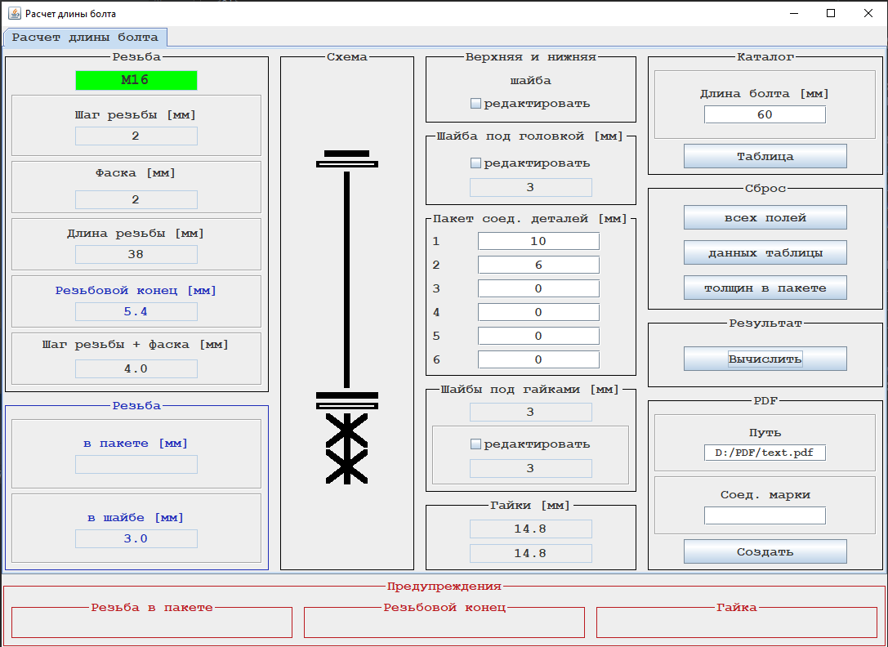
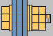
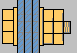
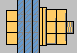
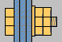
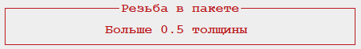
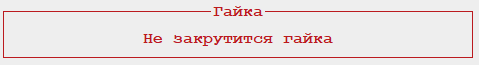
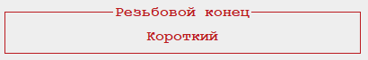
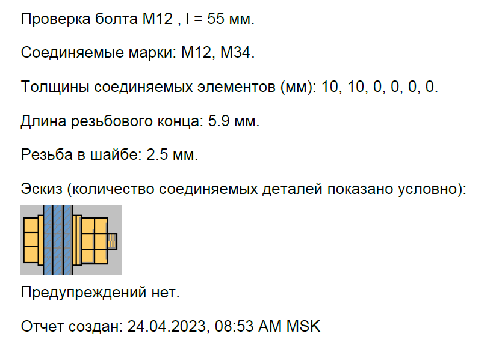

## Pro.Engineer.Java.BoltLengthCheck

### Настольное приложение для проверки длины болта.

#### Цель разработки: проверка болтового соединения на соответствие СП 16.13330.2017 (п. 14.2.5),
#### СП 70.13330.2012 (п. 4.5.4, п. 4.5.7).

***Максимальное количество соединяемых деталей - 6 шт. Анализ величины захода резьбы в пакет производится*** 
***по толщине детали, ближней к гайкам (строка 6). При необходимости, можно увеличить количество соединяемых деталей,*** 
***указав в строках 1, 2, 3, 4, 5 суммарную толщину деталей.***

***Щелкните по значку***

***в тексте ниже и получите картинку со справочной информацией.***

### Предусмотрено следующее расположение шайб: 

<!-- TABLE OF CONTENTS -->

  
1 шайба под головкой болта + 2 шайбы под гайками

  <ol>
    
  </ol>

<!-- TABLE OF CONTENTS -->

  
1 шайба под головкой болта + 1 шайба под гайками

  <ol>
    
  </ol>

<!-- TABLE OF CONTENTS -->

  
под головкой болта шайбы нет + 2 шайбы под гайками

  <ol>
    
  </ol>

<!-- TABLE OF CONTENTS -->

  
под головкой болта шайбы нет + 1 шайба под гайками

  <ol>
    
  </ol>

### Выполняются следующие проверки:

<!-- TABLE OF CONTENTS -->

  
проверка величины захода резьбы в соединяемую деталь

  <ol>
    
  </ol>

<!-- TABLE OF CONTENTS -->

  
проверка возможности закрутить гайку

  <ol>
    
  </ol>

<!-- TABLE OF CONTENTS -->

  
проверка длины резьбового конца болта, выступающего из гайки

  <ol>
    
  </ol>

### Примеры отчетов, сгенерированных приложением в pdf:

***До генерирования отчета возможно:***
- указать соединяемые марки;
- указать путь до папки с файлами pdf.

<!-- TABLE OF CONTENTS -->

  
Пример отчета без ошибки подбора длины болта

  <ol>
    
  </ol>

<!-- TABLE OF CONTENTS -->

  
Пример отчета с ошибкой подбора длины болта

  <ol>
    
  </ol>

(<a href="#readme-top">back to top</a>)
