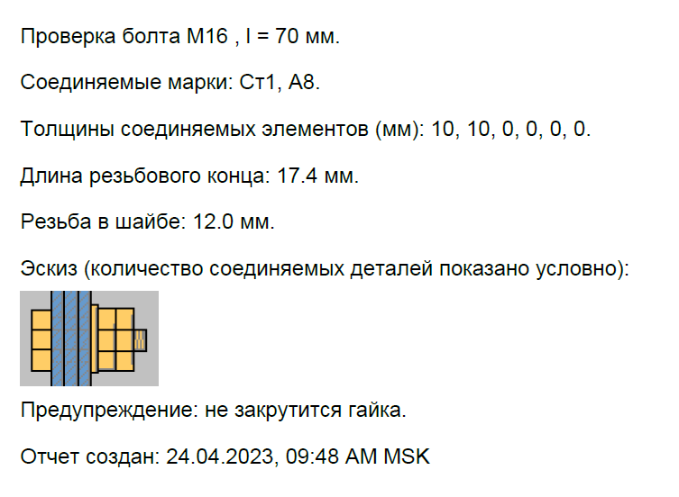

## Pro.Engineer.Java.BoltLengthCheck
### Настольное приложение предназначено для проверки длины болта.

***Максимальное количество соединяемых деталей - 6 шт. Анализ величины захода резьбы в пакет производится*** 
***по толщине детали, ближней к гайкам. При необходимости можно увеличить количество соединяемых деталей,*** 
***указав в строках 1, 2, 3, 4, 5 суммарную толщину деталей.***

### Предусмотрено следующее расположение шайб: 

<!-- TABLE OF CONTENTS -->

  
1 шайба под головкой болта + 2 шайбы под гайками

  <ol>
    
  </ol>

<!-- TABLE OF CONTENTS -->

  
1 шайба под головкой болта + 1 шайба под гайками

  <ol>
    
  </ol>

<!-- TABLE OF CONTENTS -->

  
под головкой болта шайбы нет + 2 шайбы под гайками

  <ol>
    
  </ol>

<!-- TABLE OF CONTENTS -->

  
под головкой болта шайбы нет + 1 шайба под гайками

  <ol>
    
  </ol>

### Выполняются следующие проверки:

<!-- TABLE OF CONTENTS -->

  
проверка величины захода резьбы в соединяемую деталь

  <ol>
    
  </ol>

<!-- TABLE OF CONTENTS -->

  
проверка возможности закрутить гайку

  <ol>
    
  </ol>

<!-- TABLE OF CONTENTS -->

  
проверка длины резьбового конца болта, выступающего из гайки

  <ol>
    
  </ol>

### Примеры отчетов, сгенерированных приложением в pdf:

***До генерирования отчета возможно:***
- указать соединяемые марки;
- указать путь до папки с файлами pdf.

<!-- TABLE OF CONTENTS -->

  
Пример отчета без ошибки подбора длины болта

  <ol>
    
  </ol>

<!-- TABLE OF CONTENTS -->

  
Пример отчета с ошибкой подбора длины болта

  <ol>
    
  </ol>

